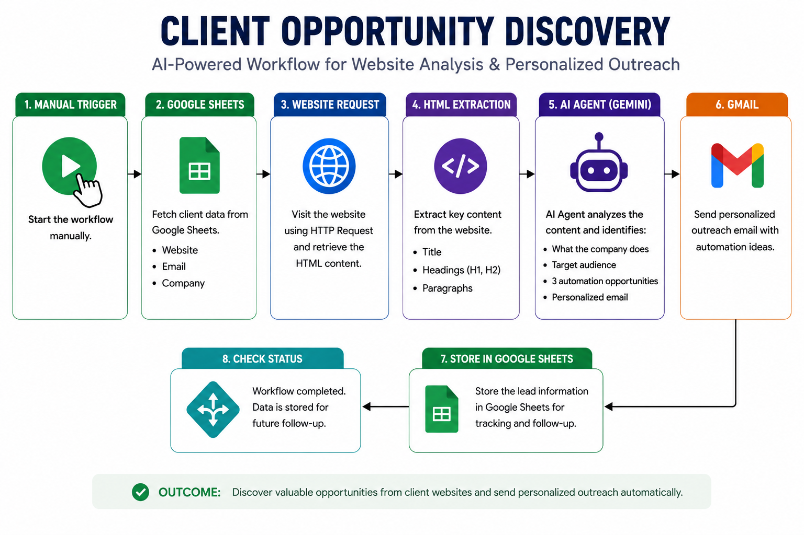

# Client Opportunity Discovery

An AI-powered n8n workflow that reads client websites, understands their business, and identifies practical opportunities where AI automation can add value.

## 🚀 What This Workflow Does

This workflow automates the initial research process for potential clients.

It:

1. Retrieves client websites from Google Sheets
2. Visits each website automatically
3. Extracts important website content such as the title, headings, and paragraphs
4. Uses Google Gemini AI to understand the client's business
5. Identifies relevant AI automation opportunities
6. Generates a personalized outreach email
7. Sends the email directly through Gmail

## ⚙️ Workflow

## 🤖 AI Capabilities

The AI Agent is instructed to:

* Understand what the company does
* Identify the target audience
* Find potential business opportunities for automation
* Use specific information from the client's website
* Suggest **3 relevant automation opportunities**
* Create a concise, personalized outreach email
* Include a clear call-to-action

## 🛠️ Tech Stack

* **n8n** — Workflow automation
* **Google Sheets** — Client/prospect data source
* **HTTP Request** — Website data retrieval
* **HTML Extract** — Website content extraction
* **Google Gemini** — AI-powered business analysis
* **AI Agent** — Opportunity discovery and outreach generation
* **Gmail** — Automated email delivery

## 💡 Use Case

Instead of manually visiting every potential client's website and researching where automation could help, this workflow performs the initial research automatically.

It can help an AI automation consultant quickly discover potential opportunities and start personalized conversations with prospects.

## 🔐 Setup

Before using the workflow, configure your own:

* Google Sheets credentials
* Google Gemini credentials
* Gmail credentials
* Google Sheet ID
* WhatsApp CTA number

The workflow JSON has been sanitized for public GitHub use. Replace the `YOUR_*` placeholders with your own configuration inside n8n.

## 📌 Portfolio Project

This project demonstrates practical experience in:

* AI Automation
* n8n Workflow Development
* AI-Powered Business Research
* Lead Generation
* Personalized Outreach
* Process Automation
  

#bluemoonways
